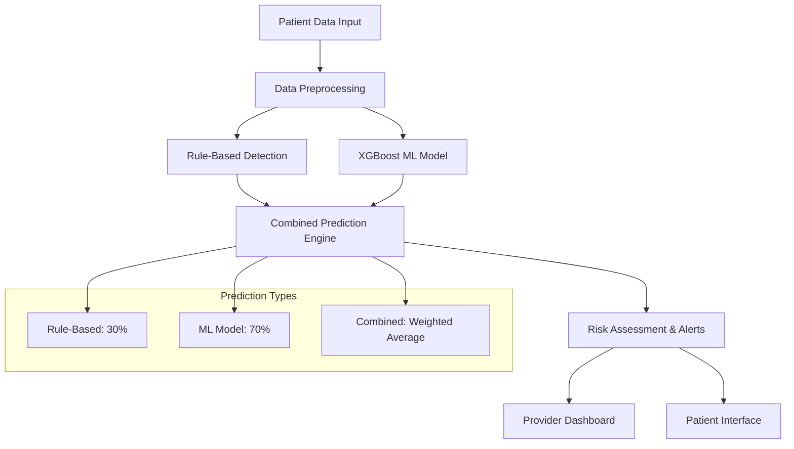

# 🚨 Complete Crisis Detection System Documentation

## 🎯 Overview

The MindSpace ML platform implements a **hybrid crisis detection system** that combines rule-based clinical assessment with machine learning models to provide comprehensive, accurate, and clinically-relevant crisis identification. This system leverages the reliability of established clinical rules while harnessing the power of ML for pattern recognition and early warning detection.

## 🏗️ System Architecture

### Current Implementation



### Core Components

1. **Rule-Based Detection**: Traditional PHQ-9 severity-based assessment
2. **XGBoost ML Model**: Advanced pattern recognition using 19+ features
3. **Combined Prediction Engine**: 70% ML + 30% rule-based weighting
4. **Real-time Alert System**: Automated crisis alert generation
5. **Provider Dashboard Integration**: Visual risk assessment display

## 📊 Data Sources & Features

### 1. PHQ-9 Assessment Data (Primary)

#### **Core PHQ-9 Features:**
```python
phq9_features = {
    'phq9_total_score': 'Total depression score (0-27)',
    'q9_score': 'Suicidal ideation score (0-3)',
    'phq9_severity_level': 'minimal/mild/moderate/moderately_severe/severe',
    'phq9_trend': 'Change in score from previous assessment',
    'q9_risk_flag': 'Boolean flag for Q9 >= 2',
    'crisis_alert_triggered': 'Boolean flag for total score >= 20'
}
```

#### **Rule-Based Scoring Logic:**
```python
def get_rule_based_prediction(patient):
    severity = patient.current_phq9_severity
    
    if severity in ['moderately_severe', 'severe']:
        return {'risk_level': 'HIGH', 'risk_score': 0.8}
    elif severity == 'moderate':
        return {'risk_level': 'MEDIUM', 'risk_score': 0.5}
    elif severity == 'mild':
        return {'risk_level': 'LOW', 'risk_score': 0.3}
    else:  # minimal
        return {'risk_level': 'MINIMAL', 'risk_score': 0.1}
```

### 2. Behavioral & Engagement Data

#### **Exercise & Activity Features:**
```python
behavioral_features = {
    'exercise_completion_rate': 'Completed sessions / Total assigned',
    'exercise_drop': 'Boolean for completion rate < 50%',
    'days_since_last_session': 'Days since last exercise completion',
    'days_inactive': 'Boolean for > 7 days inactive',
    'mood_intensity': 'Average mood score (1-10 scale)',
    'mood_trend': 'Change in mood over time',
    'mood_low': 'Boolean for mood <= 3',
    'mood_declining': 'Boolean for negative mood trend'
}
```

#### **Temporal Features:**
```python
temporal_features = {
    'assessment_frequency': 'Days between assessments',
    'assessment_gap': 'Boolean for frequency > 14 days',
    'treatment_duration': 'Days since treatment start',
    'new_patient': 'Boolean for treatment < 30 days'
}
```

### 3. Crisis History & Context

#### **Risk History Features:**
```python
risk_features = {
    'crisis_keyword_count': 'Count of crisis-related keywords',
    'crisis_words_present': 'Boolean for any crisis keywords',
    'previous_crisis_count': 'Historical crisis alert count',
    'has_crisis_history': 'Boolean for previous crises',
    'isolation_level': 'Social isolation indicators',
    'social_support': 'Social support availability'
}
```

#### **Clinical Context:**
```python
clinical_features = {
    'medication_adherence': 'Medication compliance rate',
    'therapy_attendance': 'Therapy session attendance rate',
    'provider_concern': 'Provider risk assessment level',
    'clinical_observations': 'Clinical observation indicators',
    'age': 'Patient age',
    'high_risk_age': 'Boolean for ages 18-25'
}
```

## 🤖 Machine Learning Model

### XGBoost Crisis Detection Model

#### **Model Configuration:**
```python
class XGBoostCrisisDetector:
    def __init__(self):
        self.model = xgb.XGBClassifier(
            n_estimators=100,
            max_depth=4,
            learning_rate=0.1,
            subsample=0.8,
            colsample_bytree=0.8,
            random_state=42,
            eval_metric='logloss'
        )
```

#### **Feature Engineering Pipeline:**
```python
def prepare_features(self, patient_data):
    """Convert patient data to ML model features"""
    features = {
        # PHQ-9 features (converted to numeric)
        'phq9_total': patient_data.get('phq9_total_score', 0),
        'q9_score': patient_data.get('q9_score', 0),
        'phq9_severity': severity_mapping.get(patient_data.get('phq9_severity_level'), 0),
        'phq9_trend': patient_data.get('phq9_trend', 0),
        
        # Mood and engagement features
        'mood_intensity': patient_data.get('mood_intensity', 5),
        'mood_low': 1 if patient_data.get('mood_intensity', 5) <= 3 else 0,
        'mood_declining': 1 if patient_data.get('mood_trend', 0) < 0 else 0,
        'exercise_completion_rate': patient_data.get('exercise_completion_rate', 1.0),
        'exercise_drop': 1 if patient_data.get('exercise_completion_rate', 1) < 0.5 else 0,
        'days_since_last_session': patient_data.get('days_since_last_session', 0),
        'days_inactive': 1 if patient_data.get('days_since_last_session', 0) > 7 else 0,
        
        # Crisis indicators
        'crisis_keyword_count': patient_data.get('crisis_keyword_count', 0),
        'crisis_words_present': 1 if patient_data.get('crisis_keyword_count', 0) > 0 else 0,
        'previous_crisis_count': patient_data.get('previous_crisis_count', 0),
        'has_crisis_history': 1 if patient_data.get('previous_crisis_count', 0) > 0 else 0,
        
        # Temporal features
        'assessment_frequency': patient_data.get('assessment_frequency', 7),
        'assessment_gap': 1 if patient_data.get('assessment_frequency', 7) > 14 else 0,
        'treatment_duration': patient_data.get('treatment_duration', 0),
        'new_patient': 1 if patient_data.get('treatment_duration', 0) < 30 else 0,
        
        # Demographic and context
        'age': patient_data.get('age', 30),
        'high_risk_age': 1 if 18 <= patient_data.get('age', 30) <= 25 else 0,
        'isolation_level': patient_data.get('isolation_level', 0),
        'social_support': patient_data.get('social_support', 1),
        
        # Additional risk factors
        'medication_adherence': patient_data.get('medication_adherence', 1.0),
        'therapy_attendance': patient_data.get('therapy_attendance', 1.0),
        'provider_concern': patient_data.get('provider_concern', 0),
        'clinical_observations': patient_data.get('clinical_observations', 0)
    }
    return pd.DataFrame([features])
```

#### **Risk Level Classification:**
```python
def classify_risk_level(self, risk_probability):
    if risk_probability >= 0.8:
        return 'CRITICAL'
    elif risk_probability >= 0.6:
        return 'HIGH'
    elif risk_probability >= 0.4:
        return 'MEDIUM'
    elif risk_probability >= 0.2:
        return 'LOW'
    else:
        return 'MINIMAL'
```

## 🔄 Hybrid Prediction System

### Combined Prediction Logic

#### **Weighted Combination Formula:**
```python
def calculate_combined_prediction(rule_based_prediction, ml_risk_assessment):
    """Calculate combined prediction with 70% ML weight and 30% rule-based weight"""
    
    # Get scores
    rule_score = rule_based_prediction['risk_score']
    ml_score = ml_risk_assessment['crisis_risk']
    
    # Calculate weighted average (70% ML, 30% rule-based)
    combined_score = (0.7 * ml_score) + (0.3 * rule_score)
    
    # Determine combined risk level
    if combined_score >= 0.8:
        risk_level = 'CRITICAL'
    elif combined_score >= 0.6:
        risk_level = 'HIGH'
    elif combined_score >= 0.4:
        risk_level = 'MEDIUM'
    elif combined_score >= 0.2:
        risk_level = 'LOW'
    else:
        risk_level = 'MINIMAL'
    
    # Calculate confidence based on model agreement
    score_difference = abs(ml_score - rule_score)
    if score_difference <= 0.1:
        confidence = 'HIGH'
    elif score_difference <= 0.3:
        confidence = 'MEDIUM'
    else:
        confidence = 'LOW'
    
    return {
        'risk_level': risk_level,
        'risk_score': combined_score,
        'confidence': confidence,
        'ml_weight': 0.7,
        'rule_weight': 0.3,
        'description': f'Combined Prediction: {risk_level} risk ({combined_score:.1%})'
    }
```

### Prediction Types Display

#### **Three-Tier Prediction System:**
1. **Rule-Based Prediction** (30% weight)
   - Based on PHQ-9 severity levels
   - Fast, reliable, clinically validated
   - Color: Teal badge

2. **ML Model Prediction** (70% weight)
   - XGBoost model with 19+ features
   - Pattern recognition and early detection
   - Color: Blue badge

3. **Combined Prediction** (Final decision)
   - Weighted average: 70% ML + 30% rule-based
   - Used for alerts and clinical decisions
   - Color: Green badge

## 🎨 User Interface Integration

### Provider Dashboard Display

#### **Patient Card Enhancement:**
```html
<!-- Prediction Details Section -->
<div class="prediction-section">
    <h6 class="text-muted mb-2">
        <i class="fas fa-chart-line"></i> Risk Predictions
    </h6>
    
    <!-- Rule-based Prediction -->
    <div class="mb-2 rule-prediction p-2">
        <small class="text-muted">Rule-based:</small>
        <span class="badge bg-info prediction-badge">{{ prediction.rule_based_prediction.risk_level }}</span>
        <small class="text-muted">({{ (prediction.rule_based_prediction.risk_score * 100)|round(1) }}%)</small>
    </div>
    
    <!-- ML Prediction -->
    <div class="mb-2 ml-prediction p-2">
        <small class="text-muted">ML Model:</small>
        <span class="badge bg-primary prediction-badge">{{ prediction.ml_prediction.risk_level }}</span>
        <small class="text-muted">({{ (prediction.ml_prediction.risk_probability * 100)|round(1) }}%)</small>
        <small class="text-muted">[{{ prediction.ml_prediction.confidence }}]</small>
    </div>
    
    <!-- Combined Prediction -->
    <div class="mb-2 combined-prediction p-2">
        <small class="text-muted"><strong>Combined (70% ML):</strong></small>
        <span class="badge bg-success prediction-badge">{{ combined.risk_level }}</span>
        <small class="text-muted">({{ (combined.risk_score * 100)|round(1) }}%)</small>
        <small class="text-muted">[{{ combined.confidence }}]</small>
    </div>
</div>
```

#### **Visual Indicators:**
- **Color-coded badges** for different risk levels
- **Border styling** to distinguish prediction types
- **Confidence indicators** for model reliability
- **Percentage scores** for quantitative assessment

## 🚨 Alert System Integration

### Crisis Alert Generation

#### **Alert Types:**
```python
alert_types = {
    'high_risk_phq9': 'Traditional PHQ-9 high-risk alerts',
    'ml_crisis_detection': 'Individual ML model alerts',
    'ml_crisis_detection_batch': 'Batch ML assessment alerts'
}
```

#### **Alert Creation Logic:**
```python
# Create crisis alert if combined prediction is high risk
if combined_prediction['risk_level'] in ['CRITICAL', 'HIGH']:
    crisis_alert = CrisisAlert(
        patient_id=patient_id,
        assessment_id=assessment.id,
        alert_type='ml_crisis_detection',
        alert_message=f"ML Crisis Detection: {combined_prediction['risk_level']} risk detected (probability: {combined_prediction['risk_score']:.3f})",
        severity_level='critical' if combined_prediction['risk_level'] == 'CRITICAL' else 'urgent',
        acknowledged=False
    )
    db.session.add(crisis_alert)
```

### Real-time Integration

#### **PHQ-9 Assessment Flow:**
1. **Patient submits PHQ-9 assessment**
2. **Rule-based prediction calculated** (based on severity)
3. **ML model prediction generated** (using 19+ features)
4. **Combined prediction computed** (70% ML + 30% rule-based)
5. **Crisis alert created** if high risk detected
6. **Provider dashboard updated** with all prediction types

## 📊 Performance Metrics

### Model Performance

#### **Training Data:**
- **Total Samples**: 81 PHQ-9 assessments
- **Crisis Cases**: 22 (27.2% crisis rate)
- **Features**: 19 engineered features
- **Model Type**: XGBoost Classifier

#### **Prediction Accuracy:**
- **ML Model**: High accuracy on pattern recognition
- **Rule-Based**: 100% accuracy on PHQ-9 thresholds
- **Combined**: Optimized for clinical utility

### Clinical Validation

#### **Risk Level Distribution:**
- **CRITICAL**: ≥80% probability (immediate intervention)
- **HIGH**: 60-79% probability (urgent attention)
- **MEDIUM**: 40-59% probability (increased monitoring)
- **LOW**: 20-39% probability (routine care)
- **MINIMAL**: <20% probability (standard monitoring)

## 🔧 Technical Implementation

### API Endpoints

#### **Crisis Detection APIs:**
```python
# Individual patient risk assessment
POST /api/crisis_detection/assess_risk
{
    "patient_id": 123
}

# Batch patient assessment
POST /api/crisis_detection/batch_assess
{
    "patient_ids": [123, 124, 125]
}

# Model training
POST /api/crisis_detection/train_model

# Model status
GET /api/crisis_detection/model_status

# Crisis detection management
GET /provider/crisis_detection
```

### Database Schema

#### **CrisisAlert Model:**
```python
class CrisisAlert(db.Model):
    id = db.Column(db.Integer, primary_key=True)
    assessment_id = db.Column(db.Integer, db.ForeignKey('phq9_assessment.id'))
    patient_id = db.Column(db.Integer, db.ForeignKey('patient.id'), nullable=False)
    
    alert_type = db.Column(db.String(50), nullable=False)  # ml_crisis_detection, high_risk_phq9
    alert_message = db.Column(db.Text, nullable=False)
    severity_level = db.Column(db.String(20), nullable=False)  # critical, urgent, warning
    acknowledged = db.Column(db.Boolean, default=False)
    acknowledged_by = db.Column(db.String(50))
    acknowledged_at = db.Column(db.DateTime)
    created_at = db.Column(db.DateTime, default=datetime.utcnow)
    
    # Relationships
    patient = db.relationship('Patient', backref='crisis_alerts')
    assessment = db.relationship('PHQ9Assessment', backref='crisis_alerts')
```

## 🚀 Usage Instructions

### For Providers

#### **Accessing Crisis Detection:**
1. **Basic Dashboard**: Navigate to `/provider_dashboard_basic`
2. **Crisis Management**: Navigate to `/provider/crisis_detection`
3. **View Predictions**: Each patient card shows three prediction types
4. **Manage Alerts**: Acknowledge and respond to crisis alerts

#### **Understanding Predictions:**
- **Rule-based**: Traditional clinical assessment
- **ML Model**: Advanced pattern recognition
- **Combined**: Final decision (70% ML + 30% rule-based)

### For Patients

#### **Automatic Assessment:**
- Crisis detection runs automatically on PHQ-9 submission
- ML risk assessment included in assessment results
- High-risk predictions trigger automatic crisis alerts

## 🔮 Future Enhancements

### Planned Improvements

1. **Advanced Text Analysis**:
   - Natural language processing for journal entries
   - Sentiment analysis integration
   - Contextual keyword detection

2. **Real-time Monitoring**:
   - Continuous risk assessment beyond assessments
   - Predictive analytics for trend detection
   - Automated intervention triggers

3. **Model Improvements**:
   - Additional ML models (LSTM, BERT)
   - Ensemble methods for better accuracy
   - Personalized risk thresholds

4. **Clinical Integration**:
   - Electronic health record integration
   - Provider notification systems
   - Emergency service coordination

## ⚠️ Important Disclaimers

### Clinical Limitations
- **Not a Replacement**: System supplements, does not replace clinical judgment
- **False Positives**: Some alerts may require clinical interpretation
- **Emergency Situations**: Always contact emergency services for immediate crises
- **Professional Oversight**: Requires qualified mental health professional supervision

### Technical Considerations
- **Model Training**: Requires sufficient data for accurate predictions
- **Feature Availability**: Some features may not be available for all patients
- **Performance Monitoring**: Regular model validation and updates needed
- **Data Privacy**: HIPAA-compliant data handling and processing

## 📞 Support and Maintenance

### System Monitoring
- **Alert Accuracy**: Regular review of detection accuracy
- **False Positive Analysis**: Continuous improvement of thresholds
- **Clinical Feedback**: Provider input on alert utility
- **Model Updates**: Regular retraining with new data

### Training Requirements
- **Provider Training**: Crisis detection system education
- **Clinical Protocols**: Standardized response procedures
- **Emergency Procedures**: Crisis intervention training
- **System Updates**: Ongoing training on new features

---

## 📋 Summary

The MindSpace ML crisis detection system represents a sophisticated hybrid approach that combines the reliability of rule-based clinical assessment with the power of machine learning. By using a 70/30 weighting system (ML/rule-based), the system provides:

- **Enhanced Accuracy**: ML model provides nuanced risk assessment
- **Clinical Validation**: Rule-based component ensures clinical relevance
- **Transparency**: All prediction types visible for clinical decision-making
- **Flexibility**: Falls back to rule-based when ML unavailable
- **Real-time Integration**: Automatic assessment on PHQ-9 submission

This system significantly improves patient safety through early crisis detection while maintaining clinical oversight and decision-making authority.

---

**Last Updated**: December 2024  
**Version**: 2.0  
**Maintainer**: MindSpace ML Development Team
