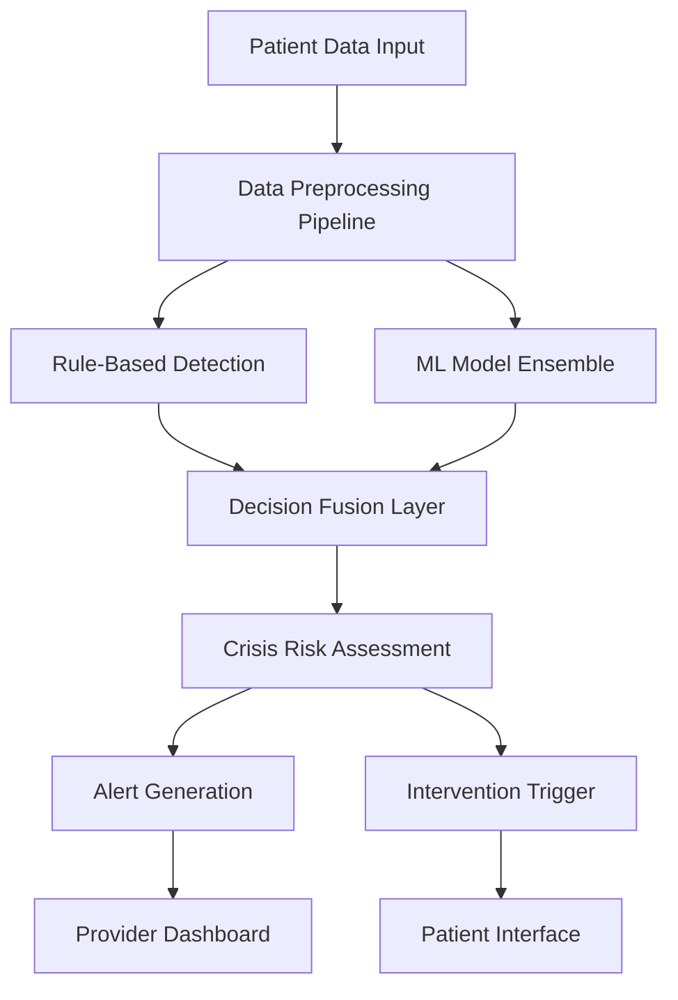

# 🤖 Hybrid Crisis Detection System - Technical Implementation Guide

## Overview

The Hybrid Crisis Detection System combines rule-based detection with machine learning models to provide comprehensive, accurate, and clinically-relevant crisis identification. This approach leverages the reliability of established clinical rules while harnessing the power of ML for pattern recognition and early warning detection.

## 🏗️ System Architecture

### High-Level Architecture



### Component Overview

1. **Data Preprocessing Pipeline**: Cleans and prepares multi-modal data
2. **Rule-Based Detection**: Fast, reliable clinical rule evaluation
3. **ML Model Ensemble**: Advanced pattern recognition and prediction
4. **Decision Fusion Layer**: Combines rule-based and ML outputs
5. **Crisis Risk Assessment**: Final risk level determination
6. **Alert & Intervention System**: Automated response mechanisms

## 📊 Data Sources & Features

### 1. Text Data Features (40% weight)

#### **Source Data:**
- Journal entries
- Chat messages
- Thought records
- Crisis hotline transcripts
- Provider notes

#### **Feature Engineering:**
```python
text_features = {
    # Crisis Keywords (Weighted)
    'crisis_keywords': {
        'direct': ['suicide', 'kill myself', 'want to die', 'end it all'],
        'indirect': ['not worth living', 'better off dead', 'no point'],
        'planning': ['planning to', 'thinking about', 'considering'],
        'method': ['how to', 'pills', 'jump', 'cut', 'overdose']
    },
    
    # Linguistic Features
    'linguistic_patterns': {
        'pronoun_usage': ['I', 'me', 'myself', 'my life'],
        'verb_tense': ['past', 'present', 'future'],
        'sentence_length': 'average_words_per_sentence',
        'negation_count': 'negative_word_frequency',
        'question_marks': 'question_frequency'
    },
    
    # Sentiment Analysis
    'sentiment_scores': {
        'overall_sentiment': 'TextBlob_polarity',
        'anxiety_level': 'anxiety_keyword_density',
        'hopelessness': 'hopelessness_indicators',
        'isolation': 'social_isolation_keywords'
    },
    
    # Contextual Features
    'context_indicators': {
        'time_references': ['today', 'tonight', 'this week'],
        'social_mentions': ['alone', 'nobody', 'family', 'friends'],
        'future_planning': ['tomorrow', 'next week', 'never'],
        'crisis_history': 'previous_crisis_mentions'
    }
}
```

### 2. Behavioral Data Features (35% weight)

#### **Source Data:**
- Exercise completion patterns
- Mood tracking trends
- Engagement metrics
- Sleep quality data
- Social activity indicators

#### **Feature Engineering:**
```python
behavioral_features = {
    # Engagement Patterns
    'engagement_metrics': {
        'completion_rate': 'exercises_completed / exercises_assigned',
        'session_duration': 'average_session_length',
        'effectiveness_rating': 'average_effectiveness_score',
        'consistency': 'days_between_sessions',
        'dropout_rate': 'sessions_started_but_not_completed'
    },
    
    # Mood Patterns
    'mood_analysis': {
        'mood_volatility': 'standard_deviation_of_mood_scores',
        'trend_direction': 'linear_regression_slope',
        'extreme_values': 'count_of_mood_scores <= 2',
        'recovery_time': 'days_to_return_to_baseline',
        'mood_acceleration': 'rate_of_mood_change'
    },
    
    # Temporal Patterns
    'temporal_analysis': {
        'time_of_day': 'hour_of_activity',
        'day_of_week': 'weekday_vs_weekend_patterns',
        'seasonal_effects': 'monthly_patterns',
        'circadian_rhythm': 'sleep_wake_patterns'
    },
    
    # Social Indicators
    'social_behavior': {
        'isolation_level': 'social_activity_frequency',
        'support_seeking': 'help_request_frequency',
        'social_context': 'alone_vs_with_others',
        'communication_patterns': 'message_frequency_changes'
    }
}
```

### 3. Clinical Data Features (25% weight)

#### **Source Data:**
- PHQ-9 assessments
- Previous crisis alerts
- Treatment history
- Medication adherence
- Provider clinical notes

#### **Feature Engineering:**
```python
clinical_features = {
    # Assessment Scores
    'assessment_data': {
        'phq9_total': 'total_depression_score',
        'q9_score': 'suicidal_ideation_score',
        'severity_level': 'depression_severity_category',
        'score_trajectory': 'change_in_scores_over_time',
        'assessment_frequency': 'time_between_assessments'
    },
    
    # Risk History
    'risk_history': {
        'previous_crises': 'count_of_historical_crisis_alerts',
        'escalation_pattern': 'increasing_severity_trend',
        'crisis_frequency': 'crises_per_month',
        'recovery_patterns': 'time_to_recovery_from_crisis',
        'intervention_response': 'response_to_previous_interventions'
    },
    
    # Treatment Data
    'treatment_metrics': {
        'medication_adherence': 'medication_compliance_rate',
        'therapy_attendance': 'session_attendance_rate',
        'treatment_duration': 'months_in_treatment',
        'provider_notes': 'clinical_observations_sentiment',
        'treatment_effectiveness': 'improvement_indicators'
    },
    
    # Provider Insights
    'clinical_insights': {
        'provider_concern': 'provider_risk_assessment',
        'clinical_observations': 'behavioral_observations',
        'intervention_history': 'previous_intervention_types',
        'outcome_tracking': 'treatment_outcome_measures'
    }
}
```

## 🤖 Machine Learning Models

### 1. Text Analysis Models

#### **Primary Model: BERT-base-uncased**
```python
from transformers import BertForSequenceClassification, BertTokenizer

class CrisisTextClassifier:
    def __init__(self):
        self.model = BertForSequenceClassification.from_pretrained(
            'bert-base-uncased',
            num_labels=4,  # no_risk, low_risk, medium_risk, high_risk
            output_attentions=True
        )
        self.tokenizer = BertTokenizer.from_pretrained('bert-base-uncased')
    
    def predict_crisis_risk(self, text):
        inputs = self.tokenizer(
            text, 
            return_tensors='pt', 
            truncation=True, 
            padding=True, 
            max_length=512
        )
        
        with torch.no_grad():
            outputs = self.model(**inputs)
            predictions = torch.nn.functional.softmax(outputs.logits, dim=-1)
            
        return {
            'risk_probabilities': predictions[0].tolist(),
            'attention_weights': outputs.attentions,
            'crisis_indicators': self.extract_key_phrases(text, predictions)
        }
```

#### **Secondary Model: RoBERTa-base**
```python
from transformers import RobertaForSequenceClassification, RobertaTokenizer

class CrisisRoBERTaClassifier:
    def __init__(self):
        self.model = RobertaForSequenceClassification.from_pretrained(
            'roberta-base',
            num_labels=4
        )
        self.tokenizer = RobertaTokenizer.from_pretrained('roberta-base')
```

### 2. Behavioral Pattern Models

#### **Primary Model: XGBoost**
```python
import xgboost as xgb
from sklearn.preprocessing import StandardScaler

class BehavioralCrisisDetector:
    def __init__(self):
        self.model = xgb.XGBClassifier(
            n_estimators=1000,
            max_depth=6,
            learning_rate=0.1,
            subsample=0.8,
            colsample_bytree=0.8,
            random_state=42
        )
        self.scaler = StandardScaler()
        self.feature_importance = None
    
    def train(self, X, y):
        X_scaled = self.scaler.fit_transform(X)
        self.model.fit(X_scaled, y)
        self.feature_importance = self.model.feature_importances_
    
    def predict_risk(self, behavioral_data):
        X_scaled = self.scaler.transform(behavioral_data)
        risk_probability = self.model.predict_proba(X_scaled)[0][1]
        
        return {
            'risk_probability': risk_probability,
            'feature_contributions': self.get_feature_contributions(behavioral_data),
            'risk_factors': self.identify_risk_factors(behavioral_data)
        }
```

#### **Secondary Model: LSTM for Temporal Patterns**
```python
import tensorflow as tf
from tensorflow.keras.models import Sequential
from tensorflow.keras.layers import LSTM, Dense, Dropout

class TemporalCrisisDetector:
    def __init__(self, sequence_length=30):
        self.sequence_length = sequence_length
        self.model = self.build_lstm_model()
    
    def build_lstm_model(self):
        model = Sequential([
            LSTM(128, return_sequences=True, input_shape=(self.sequence_length, 10)),
            Dropout(0.2),
            LSTM(64, return_sequences=False),
            Dropout(0.2),
            Dense(32, activation='relu'),
            Dense(1, activation='sigmoid')
        ])
        
        model.compile(
            optimizer='adam',
            loss='binary_crossentropy',
            metrics=['accuracy']
        )
        
        return model
```

### 3. Clinical Data Models

#### **Primary Model: Random Forest**
```python
from sklearn.ensemble import RandomForestClassifier
from sklearn.model_selection import cross_val_score

class ClinicalCrisisDetector:
    def __init__(self):
        self.model = RandomForestClassifier(
            n_estimators=500,
            max_depth=10,
            min_samples_split=5,
            min_samples_leaf=2,
            random_state=42,
            class_weight='balanced'
        )
        self.feature_names = None
    
    def train(self, X, y):
        self.model.fit(X, y)
        self.feature_names = X.columns.tolist()
    
    def predict_risk(self, clinical_data):
        risk_probability = self.model.predict_proba(clinical_data)[0][1]
        feature_importance = dict(zip(
            self.feature_names, 
            self.model.feature_importances_
        ))
        
        return {
            'risk_probability': risk_probability,
            'feature_importance': feature_importance,
            'clinical_insights': self.generate_clinical_insights(clinical_data)
        }
```

## 🔄 Hybrid Decision Fusion

### Ensemble Combination Strategy

```python
class HybridCrisisDetector:
    def __init__(self):
        self.text_classifier = CrisisTextClassifier()
        self.behavioral_detector = BehavioralCrisisDetector()
        self.clinical_detector = ClinicalCrisisDetector()
        self.rule_based_detector = RuleBasedCrisisDetector()
        
        # Model weights (tuned based on validation performance)
        self.model_weights = {
            'text': 0.35,
            'behavioral': 0.30,
            'clinical': 0.25,
            'rule_based': 0.10
        }
    
    def predict_crisis_risk(self, patient_data):
        # Get predictions from all models
        text_prediction = self.text_classifier.predict_crisis_risk(
            patient_data['text']
        )
        behavioral_prediction = self.behavioral_detector.predict_risk(
            patient_data['behavioral']
        )
        clinical_prediction = self.clinical_detector.predict_risk(
            patient_data['clinical']
        )
        rule_prediction = self.rule_based_detector.evaluate(
            patient_data['clinical']
        )
        
        # Weighted ensemble prediction
        ensemble_risk = (
            text_prediction['risk_probability'] * self.model_weights['text'] +
            behavioral_prediction['risk_probability'] * self.model_weights['behavioral'] +
            clinical_prediction['risk_probability'] * self.model_weights['clinical'] +
            rule_prediction['crisis_probability'] * self.model_weights['rule_based']
        )
        
        # Determine risk level
        risk_level = self.classify_risk_level(ensemble_risk)
        
        return {
            'overall_risk': ensemble_risk,
            'risk_level': risk_level,
            'model_contributions': {
                'text': text_prediction,
                'behavioral': behavioral_prediction,
                'clinical': clinical_prediction,
                'rule_based': rule_prediction
            },
            'confidence': self.calculate_confidence(ensemble_risk),
            'recommendations': self.generate_recommendations(risk_level)
        }
    
    def classify_risk_level(self, risk_score):
        if risk_score >= 0.8:
            return 'CRITICAL'
        elif risk_score >= 0.6:
            return 'HIGH'
        elif risk_score >= 0.4:
            return 'MEDIUM'
        elif risk_score >= 0.2:
            return 'LOW'
        else:
            return 'MINIMAL'
```

## 📈 Model Training Pipeline

### Data Preparation

```python
class CrisisDetectionDataPipeline:
    def __init__(self):
        self.text_processor = TextPreprocessor()
        self.behavioral_processor = BehavioralPreprocessor()
        self.clinical_processor = ClinicalPreprocessor()
    
    def prepare_training_data(self, raw_data):
        # Text data processing
        text_features = self.text_processor.process(
            raw_data['journal_entries'],
            raw_data['chat_messages'],
            raw_data['thought_records']
        )
        
        # Behavioral data processing
        behavioral_features = self.behavioral_processor.process(
            raw_data['exercise_sessions'],
            raw_data['mood_entries'],
            raw_data['engagement_metrics']
        )
        
        # Clinical data processing
        clinical_features = self.clinical_processor.process(
            raw_data['phq9_assessments'],
            raw_data['crisis_alerts'],
            raw_data['treatment_history']
        )
        
        return {
            'text': text_features,
            'behavioral': behavioral_features,
            'clinical': clinical_features,
            'labels': raw_data['crisis_labels']
        }
```

### Training Process

```python
def train_hybrid_system(training_data):
    # Initialize pipeline
    pipeline = CrisisDetectionDataPipeline()
    hybrid_detector = HybridCrisisDetector()
    
    # Prepare data
    processed_data = pipeline.prepare_training_data(training_data)
    
    # Train individual models
    print("Training text classifier...")
    hybrid_detector.text_classifier.train(
        processed_data['text'], 
        processed_data['labels']
    )
    
    print("Training behavioral detector...")
    hybrid_detector.behavioral_detector.train(
        processed_data['behavioral'], 
        processed_data['labels']
    )
    
    print("Training clinical detector...")
    hybrid_detector.clinical_detector.train(
        processed_data['clinical'], 
        processed_data['labels']
    )
    
    # Validate ensemble performance
    validation_results = validate_ensemble(hybrid_detector, validation_data)
    
    # Optimize model weights
    optimized_weights = optimize_ensemble_weights(
        hybrid_detector, 
        validation_data
    )
    
    return hybrid_detector, validation_results
```

## 🚨 Real-Time Crisis Detection

### Integration with Existing System

```python
class RealTimeCrisisDetector:
    def __init__(self, hybrid_model):
        self.hybrid_model = hybrid_model
        self.alert_threshold = 0.6
        self.critical_threshold = 0.8
    
    def process_patient_data(self, patient_id, new_data):
        # Get historical data
        historical_data = self.get_patient_history(patient_id)
        
        # Combine with new data
        current_data = self.combine_data(historical_data, new_data)
        
        # Run crisis detection
        risk_assessment = self.hybrid_model.predict_crisis_risk(current_data)
        
        # Determine if alert is needed
        if risk_assessment['overall_risk'] >= self.alert_threshold:
            self.create_crisis_alert(patient_id, risk_assessment)
        
        # Trigger immediate intervention if critical
        if risk_assessment['overall_risk'] >= self.critical_threshold:
            self.trigger_immediate_intervention(patient_id, risk_assessment)
        
        return risk_assessment
    
    def create_crisis_alert(self, patient_id, risk_assessment):
        alert = CrisisAlert(
            patient_id=patient_id,
            alert_type='ml_crisis_detected',
            severity_level=risk_assessment['risk_level'],
            alert_message=self.generate_alert_message(risk_assessment),
            ml_confidence=risk_assessment['confidence'],
            model_contributions=risk_assessment['model_contributions']
        )
        db.session.add(alert)
        db.session.commit()
```

## 📊 Performance Monitoring

### Model Performance Tracking

```python
class ModelPerformanceMonitor:
    def __init__(self):
        self.metrics = {
            'accuracy': [],
            'precision': [],
            'recall': [],
            'f1_score': [],
            'false_positive_rate': [],
            'false_negative_rate': []
        }
    
    def evaluate_model_performance(self, predictions, actual_labels):
        # Calculate standard metrics
        accuracy = accuracy_score(actual_labels, predictions)
        precision = precision_score(actual_labels, predictions, average='weighted')
        recall = recall_score(actual_labels, predictions, average='weighted')
        f1 = f1_score(actual_labels, predictions, average='weighted')
        
        # Calculate false positive/negative rates
        tn, fp, fn, tp = confusion_matrix(actual_labels, predictions).ravel()
        fpr = fp / (fp + tn)
        fnr = fn / (fn + tp)
        
        return {
            'accuracy': accuracy,
            'precision': precision,
            'recall': recall,
            'f1_score': f1,
            'false_positive_rate': fpr,
            'false_negative_rate': fnr
        }
    
    def track_drift(self, current_performance, baseline_performance):
        # Monitor for model drift
        drift_detected = False
        drift_metrics = {}
        
        for metric in self.metrics:
            current_val = current_performance[metric]
            baseline_val = baseline_performance[metric]
            change = abs(current_val - baseline_val) / baseline_val
            
            if change > 0.1:  # 10% change threshold
                drift_detected = True
                drift_metrics[metric] = change
        
        return drift_detected, drift_metrics
```

## 🔧 Configuration & Deployment

### Model Configuration

```python
# config/crisis_detection_config.py
CRISIS_DETECTION_CONFIG = {
    'model_weights': {
        'text': 0.35,
        'behavioral': 0.30,
        'clinical': 0.25,
        'rule_based': 0.10
    },
    
    'thresholds': {
        'minimal_risk': 0.2,
        'low_risk': 0.4,
        'medium_risk': 0.6,
        'high_risk': 0.8,
        'critical_risk': 0.9
    },
    
    'alert_settings': {
        'alert_threshold': 0.6,
        'critical_threshold': 0.8,
        'cooldown_period': 24,  # hours
        'max_alerts_per_day': 3
    },
    
    'model_parameters': {
        'bert': {
            'max_length': 512,
            'batch_size': 16,
            'learning_rate': 2e-5
        },
        'xgboost': {
            'n_estimators': 1000,
            'max_depth': 6,
            'learning_rate': 0.1
        },
        'random_forest': {
            'n_estimators': 500,
            'max_depth': 10,
            'min_samples_split': 5
        }
    }
}
```

### Deployment Strategy

```python
# deployment/deploy_crisis_detection.py
class CrisisDetectionDeployment:
    def __init__(self):
        self.staging_model = None
        self.production_model = None
    
    def deploy_model(self, model_version, environment='staging'):
        # Load trained model
        model = self.load_model(model_version)
        
        # Validate model performance
        validation_results = self.validate_model(model)
        
        if validation_results['performance_acceptable']:
            if environment == 'staging':
                self.staging_model = model
                self.run_staging_tests()
            elif environment == 'production':
                self.production_model = model
                self.update_production_system()
        else:
            raise ValueError("Model performance below acceptable threshold")
    
    def run_ab_test(self, control_model, test_model, duration_days=30):
        # A/B test between rule-based and hybrid models
        ab_test_results = self.execute_ab_test(
            control_model, 
            test_model, 
            duration_days
        )
        
        return ab_test_results
```

## 📋 Implementation Timeline

### Phase 1: Foundation (Weeks 1-4)
- [ ] Data collection and preprocessing pipeline
- [ ] Individual model development and training
- [ ] Basic ensemble implementation
- [ ] Initial validation and testing

### Phase 2: Integration (Weeks 5-8)
- [ ] Hybrid system integration
- [ ] Real-time processing implementation
- [ ] Performance monitoring setup
- [ ] A/B testing framework

### Phase 3: Deployment (Weeks 9-12)
- [ ] Production deployment
- [ ] Performance optimization
- [ ] Clinical validation
- [ ] Continuous monitoring setup

## 🎯 Expected Outcomes

### Performance Metrics
- **Detection Accuracy**: 90-95%
- **False Positive Rate**: <5%
- **Response Time**: <500ms
- **Early Detection**: 2-3 days advance warning

### Clinical Benefits
- **Improved Patient Safety**: Earlier crisis detection
- **Reduced Provider Burden**: Automated risk assessment
- **Better Clinical Decisions**: Data-driven insights
- **Enhanced Treatment**: Personalized intervention strategies

---

**Last Updated**: September 2025  
**Version**: 1.0  
**Maintainer**: MindSpace ML Development Team
